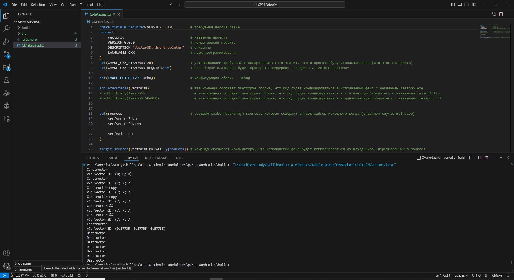

# МОЯ ПОШАГОВАЯ ИНСТРУКЦИЯ

## 1. Первые шаги

1. В созданной папке создаю виртуальное окружение Python и активирую его
```bash
python -m venv venv
# Для WIN
./venv/Scripts/activate
```

2. Устанавливаю PYBIND11
```bash
pip install pybind11
```

3. Создаю структуру проекта
```
|- src 
|       |- vector3d.h       # header исходника моего вектора
|       |- vector3d.cpp     # основной файл с кодом моего вектора
|       |- main.cpp         # файл, который будет инклюдить vector3d.h, а также содержать код pybind11 (который будет содержать meta-код для байндингов)
|- setup.py                 # файл, который создаст распространяемую библиотеку, а также упростит процесс сборки библиотеки
```

4. Запоняю файл **setup.py**
```python
import pybind11
from distutils.core import setup, Extension

ext_modules = [
    Extension(
        'library',                                              # название нашей либы
        sources = ['./src/vector3d.cpp', './src/main.cpp'],     # файлики которые компилируем
        include_dirs=[pybind11.get_include()],                  # не забываем добавить инклюды pybind11
        language='c++',
        extra_compile_args=['-std=c++17'],                      # используем с++17
    ),
]

setup(
    name='library',
    version='0.0.1',
    author='Dax',
    author_email='John-Xenos@mail.ru',
    description='pybind11 extension for vector3d',
    ext_modules=ext_modules,
    requires=['pybind11']                                       # не забываем указать зависимость от pybind11
)
```

5. Хотя у нас пока нет никакого кода, но уже можно собрать расширение, для этого запускаю:
```bash
python setup.py build_ext -i
```  
здесь:  
**build_ext** - обозначает, что буду собирать расширения, то есть те самые Extension, которые описаные в атрибуте *ext_modules* команды *setup* (см. setup.py)  
**флаг -i** - значит, что хочу, чтобы библиотека (*.so / *.pyd файл) сгенерировалась на том же уровне, что и файл *setup.py*

> Иногда приходится 2 раза запускать, т.к. 1 раз он собирает в build -> lib.win-amd64-cpython-311 -> library.cp311-win_amd64.pyd. Со второго раза он копирует собранную библиотеку в общую директорию с *setup.py*. В общем надо смотреть на последнюю строку терминала, где должно появиться: `copying build\lib.win-amd64-cpython-311\library.cp311-win_amd64.pyd ->`  
где library - это название библиотеки, а постфикс cp311-win_amd64 - описание конфигурации, на которой собиралось расширение.

6. В **main.cpp**:
```c++
#include <pybind11/pybind11.h>

PYBIND11_MODULE(library, m) {
};
```
* #include <pybind11/pybind11.h> - это подключил pybind.
* PYBIND11_MODULE(library, m) - макрос, который поволяет нам определить python модуль. Важно: имя модуля (первый аргумент *library*) должно совподать с именем, указаным в setup.py, иначе при импорте модуля будет возникать ошибка. Второй аргумент *m* - это, своего рода, "фабрика", с помощью которой можно расширять функциональность библиотеки, добавлять функции, класы и т.д.

7. Для тестирования запущу в терминале *python* и выполню импорт созданного модуля *library*
```bash
python
import library
print(library)
```
В строке появится: `<module 'library' from 'E:\\archive\\study\\skillbox\\C++_4_robotics\\module_10\\test5\\library.cp311-win_amd64.pyd'>`  
Что по сути означает, что модуль загрузился!

## 2. Добавление функции

1. В файле **vector3d.h** (описывать нет смысла, т.к. простейшее объявление функции в заголовочном файле):
```c++
#pragma once

int add(const int &, const int &);
```

2. В файле **vector3d.cpp** (описывать нет смысла, т.к. простейшее описание функции):
```c++
#include "vector3d.h"

int add(const int &a, const int &b) {
    return a + b;
}
```

3. В файле **main.cpp** прописываю функцию сложения 2-х чисел, а также лямбда-функцию вычитания 2-х чисел. Также здесь тестирую указание аргументов и их значений по умолчанию:
```c++
#include <pybind11/pybind11.h>
#include "vector3d.h"                                           // добавляю инклюд заголовочного файла vector3d.h

namespace py = pybind11;                                        // для сокращения написания namespace

PYBIND11_MODULE(library, m) {
    // опциональное описание модуля
    m.doc() = R"pbdoc(
        Pybind11 example plugin
        -----------------------

        .. currentmodule:: library

        .. autosummary::
           :toctree: _generate

           add
           subtract
    )pbdoc";
    m.def("add", &add, R"pbdoc(
        Add two numbers

        Some other explanation about the add function.
    )pbdoc", py::arg("x") = 3, py::arg("y") = 4);

    m.def("subtract", [](int i, int j) { return i - j; }, R"pbdoc(
        Subtract two numbers

        Some other explanation about the subtract function.
    )pbdoc");
};
```

4. Тестирую:
```bash
python
import library
print(library.add(3, 4))
print(library.subtract(10, 3))
```
и о чудо, вижу наконец-то ниже 7 и 7!

5. Для тестирования создаю отдельный файл **test.py** и проверяю на нем:
```python
import library

print(library.add())
print(library.subtract(10, 3))
```
Все отлично работает как и в пункте выше.

6. Из простых основ также рассмотрю экспорт переменных:
```c++
...
m.attr("the_answer") = 77;
py::object world = py::cast("World");
m.attr("what") = world;
...
```

7. В ходе тестирования:
```python
import library

print(library.add())
print(library.subtract(10, 3))

print(library.the_answer)
print(library.what)
```
все также корректно выводятся соответствующие значения!

## Объектно-ориентированный код

1. Для изучения работы **pybind11** с классами, создаю в *vector3d.h* простейший класс *Домашнее животное*. В открытый конструктор передается имя домашнего животного, которое в свою очередь располагается в приватной части класса, а также открытые методы для вывода имени и устновки нового имени:
```c++
class Pet {
public:
    Pet(const std::string &name) : name(name) { }
    void setName(const std::string &name_) { name = name_; }
    const std::string &getName() const { return name; }

private:
    std::string name;
};
``` 

2. После пересборки `python setup.py build_ext -i` тестирую работу клсса в *python*:
```python
import library

print(library.add())
print(library.subtract(10, 3))

print(library.the_answer)
print(library.what)

p = library.Pet("Richard")
print(p)
print(p.name)
p.name = "Bob"
print(p.name)
```
и вижу, что все отлично работает!

## Написание класса Vector3D

1. Класс Vector3D включает в себя в приватной части *union* объединяющий структуру, хрянящую 3 координаты вектора и массив длиной 3, для хранения координат в массиве.  
Кроме того, там же хранится переменная, определяющая точность при сравнении 2-х векторов.
```c++
private:
    union
	{
		struct
		{
			double x, y, z;
		};
		double v[3];
	};
    double EPSILON = 0.001l;
```

2. В публичной части как раз и располагаются конструкторы и методы, необходимые для работы.

    2.1. Простейший конструктор, который создает нулевой вектор.
    ```c++
    <vector3d.h>
    Vector3D() : x(0), y(0), z(0) {}
    ```

    2.2. Стандартный конструктор копирования
    ```c++
    <vector3d.h>
    Vector3D(Vector3D& other) : x(other.x), y(other.y), z(other.z) {}
    ```
    
    2.3. Конструктор перемещения. Необходим для работы методов, возвращающих новый вектор. К примеру *cross*, *sum*, *sub*, о которых будет рассказано позже.
    ```c++
    <vector3d.h>
    Vector3D(Vector3D&& moved) { x=moved.x; y=moved.y; z=moved.z; }
    ```

    2.4. Конструктор с задаваемыми координатами вектора.
    ```c++
    <vector3d.h>
    Vector3D(double _x, double _y, double _z) : x(_x),y(_y),z(_z){}
    ```

    2.5. Сеттеры и геттеры для координат.
    ```c++
    <vector3d.h>
    void setX(double x) { this->x = x; };
    void setY(double y) { this->y = y; };
    void setZ(double z) { this->z = z; };
    double getX() { return this->x; };
    double getY() { return this->y; };
    double getZ() { return this->z; };
    ```

    2.6. Метод, формирующий строковое представление вектора.
    ```c++
    <vector3d.h>
    std::string toString() const { return "[" + std::to_string(x) + ", " + std::to_string(y) + ", " + std::to_string(z) + "]"; };
    ```

    2.7. Метод, переопределяющий оператор присваивания. Необходим для присваивания одного вектора, другому.
    ```c++
    <vector3d.h>
    Vector3D& operator= (Vector3D& other) { x=other.x; y=other.y; z=other.z; return *this; };
    ```

    2.8. Метод, переопределяющий оператор сравнения. Необходим для сравнения векторов.
    ```c++
    <vector3d.h>
    bool operator== (Vector3D& other);
    ```
    ```c++
    <vector3d.cpp>
    bool Vector3D::operator== (Vector3D& other)
    {
        if (fabs(x-other.x) < EPSILON)
            if (fabs(y-other.y) < EPSILON)
                if (fabs(z-other.z) < EPSILON)
                    return true;
        return false;
    }
    ```

    2.9. Метод расчета длины (величины) вектора. От слова magnitude - величина.
    ```c++
    <vector3d.h>
    double magnitude() { return std::sqrt(x * x + y * y + z * z); };
    ```

    2.10. Метод для унарной операции обращения направления вектора.
    ```c++
    <vector3d.h>
    Vector3D& operator- () { x=-x; y=-y; z=-z; return *this; };
    ```

    2.11. Методы сложения и вычитания с присваиванием.
    ```c++
    <vector3d.h>
    Vector3D& operator-= (Vector3D& other) { x-=other.x; y-=other.y; z-=other.z; return *this; };
    Vector3D& operator+= (Vector3D& other) { x+=other.x; y+=other.y; z+=other.z; return *this; };
    ```

    2.12. Методы для умножения и деления вектора на скаляр.
    ```c++
    <vector3d.h>
    Vector3D& operator*= (double& a) { x*=a; y*=a; z*=a; return *this; };
    Vector3D& operator/= (double& a) { x/=a; y/=a; z/=a; return *this; };
    ```

    2.13. Скалярное умножение векторов реализовано через переопределение оператора умножения. Результатом здесь является число.
    ```c++
    <vector3d.h>
    double operator* (Vector3D& other) { return x*other.x + y*other.y + z*other.z; };
    ```

    2.14. Векторное умножение векторов реализовано отдельным методом, т.к. соответствующего оператора не нашлось. По результату возвращается вектор r-value, который и должен переместиться в новую переменную, типа Vector3D.
    ```c++
    <vector3d.h>
    Vector3D cross(const Vector3D& other) const { return Vector3D(y*other.z - z*other.y, z*other.x - x*other.z, x*other.y - y*other.x); };
    ```

    2.15. Методы суммирования и вычитания векторов, так же реализованы через отдельные функции, просто так. В самом *python* методы *__add__* и *__sub__* уже заняты.
    ```c++
    <vector3d.h>
    Vector3D sum(const Vector3D& other) const { return Vector3D(x+other.x, y+other.y, z+other.z); };
    Vector3D sub(const Vector3D& other) const { return Vector3D(x-other.x, y-other.y, z-other.z); };
    ```

    2.16. Метод нормализации вектора.
    ```c++
    <vector3d.h>
    Vector3D& normalize();
    ```
    ```c++
    <vector3d.cpp>
    Vector3D& Vector3D::normalize()
    {
        double mag = magnitude();
        if (mag > 0)
        {
            double invertedMag = 1 / mag;
            x *= invertedMag;
            y *= invertedMag;
            z *= invertedMag;
        }
        return *this;
    }
    ```

    2.17. В целом итог:
    ```c++
    <vector3d.h>
    #pragma once
    #include <pybind11/pybind11.h>
    #include <string>
    #include <iostream>

    using std::cout;
    using std::endl;

    namespace py = pybind11;


    int add(const int &, const int &);

    class Pet {
    public:
        Pet(const std::string &name) : name(name) { }
        void setName(const std::string &name_) { name = name_; }
        const std::string &getName() const { return name; }

    private:
        std::string name;
    };

    class Vector3D
    {
    private:
        union
        {
            struct
            {
                double x, y, z;
            };
            double v[3];
        };
        double EPSILON = 0.001l;

    public:
        Vector3D() : x(0), y(0), z(0) {}
        Vector3D(Vector3D& other) : x(other.x), y(other.y), z(other.z) {}           // Конструктор копирования
        Vector3D(Vector3D&& moved) { x=moved.x; y=moved.y; z=moved.z; }             // Конструктор перемещения
        Vector3D(double _x, double _y, double _z) : x(_x),y(_y),z(_z){}
        void setX(double x) { this->x = x; };
        void setY(double y) { this->y = y; };
        void setZ(double z) { this->z = z; };
        double getX() { return this->x; };
        double getY() { return this->y; };
        double getZ() { return this->z; };
        // Строка с координатами вектора
        std::string toString() const { return "[" + std::to_string(x) + ", " + std::to_string(y) + ", " + std::to_string(z) + "]"; };
        // Присваивание векторов
        Vector3D& operator= (Vector3D& other) { x=other.x; y=other.y; z=other.z; return *this; };
        // Сравнение векторов
        bool operator== (Vector3D& other);
        // Величина вектора (magnitude - величина)
        double magnitude() { return std::sqrt(x * x + y * y + z * z); };
        // Отрицательный вектор (унарная операция!!!)
        Vector3D& operator- () { x=-x; y=-y; z=-z; return *this; };
        // Сложение с присвоением
        Vector3D& operator-= (Vector3D& other) { x-=other.x; y-=other.y; z-=other.z; return *this; };
        // Вычитание с присвоением
        Vector3D& operator+= (Vector3D& other) { x+=other.x; y+=other.y; z+=other.z; return *this; };
        // Умножение вектора на скаляр
        Vector3D& operator*= (double& a) { x*=a; y*=a; z*=a; return *this; };
        // Деление вектора на скаляр
        Vector3D& operator/= (double& a) { x/=a; y/=a; z/=a; return *this; };
        // Скалярное умножение векторов
        double operator* (Vector3D& other) { return x*other.x + y*other.y + z*other.z; };
        // Векторное произведение векторов
        Vector3D cross(const Vector3D& other) const { return Vector3D(y*other.z - z*other.y, z*other.x - x*other.z, x*other.y - y*other.x); };
        // Сложение векторов
        Vector3D sum(const Vector3D& other) const { return Vector3D(x+other.x, y+other.y, z+other.z); };
        // Вычитание векторов
        Vector3D sub(const Vector3D& other) const { return Vector3D(x-other.x, y-other.y, z-other.z); };
        // Нормализация вектора
        Vector3D& normalize();
    };
    ```
    ```c++
    <vector3d.cpp>
    #include "vector3d.h"
    #include <cmath>
    #include <pybind11/operators.h>


    int add(const int &a, const int &b) {
        return a + b;
    }

    bool Vector3D::operator== (Vector3D& other)
    {
        if (fabs(x-other.x) < EPSILON)
            if (fabs(y-other.y) < EPSILON)
                if (fabs(z-other.z) < EPSILON)
                    return true;
        return false;
    }

    Vector3D& Vector3D::normalize()
    {
        double mag = magnitude();
        if (mag > 0)
        {
            double invertedMag = 1 / mag;
            x *= invertedMag;
            y *= invertedMag;
            z *= invertedMag;
        }
        return *this;
    }
    ```

3. Добавление описанных выше методов в **main.cpp** для возможности работы с ними в *Python*

    3.1. Прописываю новый класс в `PYBIND11_MODULE(library, m) { ... }`
    ```c++
    py::class_<Vector3D>(m, "Vector3D")
    ```

    3.2. Регистрирую 3 конструктора. Конструктор перемещения здесь не удется прописать, но как я понял и не нужно.
    ```c++
    .def(py::init<>())
    .def(py::init<Vector3D&>())
    .def(py::init<double, double, double>())
    ```

    3.3. Доступ к координатам реализовал через функцию-свойство.
    ```c++
    .def_property("X", &Vector3D::getX, &Vector3D::setX)
    .def_property("Y", &Vector3D::getY, &Vector3D::setY)
    .def_property("Z", &Vector3D::getZ, &Vector3D::setZ)
    ```

    3.4. Далее стандарные привязки методов *C++* к функциям *Python*.
    ```c++
    .def("toString", &Vector3D::toString)
    .def("assign", &Vector3D::operator=)
    .def("__eq__", &Vector3D::operator==)
    .def("length", &Vector3D::magnitude)
    .def("__sub__", &Vector3D::operator-=)
    .def("__add__", &Vector3D::operator+=)
    .def("cross", &Vector3D::cross)
    .def("sum", &Vector3D::sum)
    .def("sub", &Vector3D::sub)
    .def("norm", &Vector3D::normalize)
    ```

    3.5. Следующие привязки содержат заготовку под переопределяемые методы, но *python* не позволил так просто переопределить магические методы. Так что здесь можно было бы легко обойтись и обычными привязками.
    ```c++
    .def("__neg__", py::overload_cast<>(&Vector3D::operator-))
    .def("__truediv__", py::overload_cast<double&>(&Vector3D::operator/=))
    ```

    3.6. Метод, который был переопределен как в *C++* так и в *Python*, это умножение вектора на скаляр с привоением, а также скалярное умножение векторов.
    ```c++
    .def("__mul__", py::overload_cast<double&>(&Vector3D::operator*=))
    .def("__mul__", py::overload_cast<Vector3D&>(&Vector3D::operator*))
    ```

    3.7. В отдельных источниках был указан другой метод для привязки
    ```c++
    PYBIND11_PLUGIN(library) {
        py::module m("library", "pybind11 library plugin");
        ...
        return m.ptr();
    };
    ```
    Но компилятор хоть и отрабатывает, но сообщает, что это устарвший метод и лучше пользоваться `PYBIND11_MODULE(library, m) ( ... )`.

    3.8. В целом **main.cpp** получился:
    ```c++
    #include <pybind11/pybind11.h>
    #include "vector3d.h"                                           // добавляю инклюд заголовочного файла vector3d.h

    namespace py = pybind11;                                        // для сокращения написания namespace

    PYBIND11_MODULE(library, m) {
        // опциональное описание модуля
        m.doc() = R"pbdoc(
            Pybind11 example plugin
            -----------------------

            .. currentmodule:: cmake_example

            .. autosummary::
            :toctree: _generate

            add
            subtract
        )pbdoc";
        m.def("add", &add, R"pbdoc(
            Add two numbers

            Some other explanation about the add function.
        )pbdoc", py::arg("x") = 3, py::arg("y") = 4);

        m.def("subtract", [](int i, int j) { return i - j; }, R"pbdoc(
            Subtract two numbers

            Some other explanation about the subtract function.
        )pbdoc");

        m.attr("the_answer") = 77;
        py::object world = py::cast("World");
        m.attr("what") = world;

        py::class_<Pet>(m, "Pet")
            .def(py::init<const std::string &>())
            .def_property("name", &Pet::getName, &Pet::setName)
            .def("__repr__",
                [](const Pet &a) {
                    // return "<example.Pet named '" + a.getName() + "'>";
                    return "<example.Pet named '" + a.getName() + "'>";
                }
            );

        py::class_<Vector3D>(m, "Vector3D")
            .def(py::init<>())
            .def(py::init<Vector3D&>())
            .def(py::init<double, double, double>())
            .def_property("X", &Vector3D::getX, &Vector3D::setX)
            .def_property("Y", &Vector3D::getY, &Vector3D::setY)
            .def_property("Z", &Vector3D::getZ, &Vector3D::setZ)
            .def("toString", &Vector3D::toString)
            .def("assign", &Vector3D::operator=)
            .def("__eq__", &Vector3D::operator==)
            .def("length", &Vector3D::magnitude)
            .def("__neg__", py::overload_cast<>(&Vector3D::operator-))
            .def("__sub__", &Vector3D::operator-=)
            .def("__add__", &Vector3D::operator+=)
            .def("__mul__", py::overload_cast<double&>(&Vector3D::operator*=))
            .def("__mul__", py::overload_cast<Vector3D&>(&Vector3D::operator*))
            .def("cross", &Vector3D::cross)
            .def("sum", &Vector3D::sum)
            .def("sub", &Vector3D::sub)
            .def("__truediv__", py::overload_cast<double&>(&Vector3D::operator/=))
            .def("norm", &Vector3D::normalize);
    };
    ```

## Итог компиляции и тестирование

1. Выполнив компиляцию `python setup.py build_ext -i` я получаю рядом с *setup.py* файл динамической библиотеки *C++* с привязками для *Python*.
> library.cp311-win_amd64.pyd

2. Для тестирования создаю новый файл **test.py** где и прописываю код тестирования.

    2.1. В певую очередь импортирую созданный модуль, который назывался у меня ***library***
    ```python
    <test.py>
    import library
    ...
    ```

    2.2. Для тестирования функций сложения и вычитания вывожу результаты работы этих функций.
    ```python
    <test.py>
    ...
    print(library.add())
    print(library.subtract(10, 3))
    ...
    ```
    2.3. Для тестирования работы объектно-ориентированного кода создаю объект тестового класса *Pet*б вывожу объект, вывожу атрибут *name* объекта, переименовываю, и снова вывожу атрибут *name* объекта.
    ```python
    <test.py>
    ...
    p = library.Pet("Richard")
    print(p)
    print(p.name)
    p.name = "Bob"
    print(p.name)
    ...
    ```

    2.4. Для тестирования класса Vector3D:
    * создаю нулевой вектор 1, используя нулевой конструктор и вывожу его строковое представление
    ```python
    <test.py>
    ...
    v1 = library.Vector3D()
    print("v1:", v1.toString())
    ...
    ```
    * создаю вектор 2, используя конструктор с координатами и вывожу его строковое представление
    ```python
    <test.py>
    ...
    v2 = library.Vector3D(7., 7., 7.)
    print("v2:", v2.toString())
    ...
    ```
    * создаю вектор 3 передав в конструктор вектор 2, и вывожу его строковое представление
    ```python
    <test.py>
    ...
    v3 = library.Vector3D(v2)
    print("v3:", v3.toString())
    ...
    ```
    * вывожу результаты сравнений вектора 1 и вектора 3, а также вектора 2 и вектора 3
    ```python
    <test.py>
    ...
    print("v1 == v3:", v1 == v3)
    print("v2 == v3:", v2 == v3)
    ...
    ```
    * Вывожу величины векторов 1 и 3
    ```python
    <test.py>
    ...
    print("Magnitude v1:", v1.length())
    print("Magnitude v3:", v3.length())
    ...
    ```
    * Обращаюб вектор 3 и вывожу его строковое представление
    ```python
    <test.py>
    ...
    -v3
    print("v3:", v3.toString())
    ...
    ```
    * Проверяю работу сложения векторов с присвоением, добавляя к вектору 2 вектор 3, и вывожу строковое представление вектора 2
    ```python
    <test.py>
    ...
    v2 + v3
    print("v2:", v2.toString())
    ...
    ```
    * Присваиваю новые координаты вектору 2, проверяя работу функций-свойств геттеров-сеттеров. И вывожу его.
    ```python
    <test.py>
    ...
    v2.X = 5
    v2.Y = 6
    v2.Z = 7
    print("v2:", v2.toString())
    ...
    ```
    * Вывожу строковое представление вектора 2 после умножения его на 2 и последующего делеия на 2
    ```python
    <test.py>
    ...
    v2 * 2
    print("v2:", v2.toString())
    v2 / 2
    print("v2:", v2.toString())
    ...
    ```
    * Вывожу значение результата скалярного произведения векторов 2 и 3
    ```python
    <test.py>
    ...
    print(v2 * v3)
    ...
    ```
    * Создаю и сохраняю в вектор 4 результат вектороного умножения векторов 2 и 3, а также вывожу строковое представление полученного вектора 4.
    ```python
    <test.py>
    ...
    v4 = v2.cross(v3)
    print("v4:", v4.toString())
    ...
    ```
    * Создаю и сохраняю в векторы 5 и 6 результаты сложения и вычитания векторов 3 и 2, а также вывожу строковое представление полученных векторов.
    ```python
    <test.py>
    ...
    v5 = v3.sum(v2)
    print("v5:", v5.toString())
    v6 = v3.sub(v2)
    print("v6:", v6.toString())
    ...
    ```
    * Сохраняю в вектор 7 вектор 6, нормализую полученный вектор и вывожу его.
    ```python
    <test.py>
    ...
    v7 = v6
    print(v7.norm().toString())
    ...
    ```

    2.5. Результаты тестов:  
    

3. В итоге получил такой файл
```python
<test.py>
import library

print(library.add())
print(library.subtract(10, 3))

print(library.the_answer)
print(library.what)

p = library.Pet("Richard")
print(p)
print(p.name)
p.name = "Bob"
print(p.name)

v1 = library.Vector3D()
print("v1:", v1.toString())
v2 = library.Vector3D(7., 7., 7.)
print("v2:", v2.toString())
v3 = library.Vector3D(v2)
print("v3:", v3.toString())
print("v1 == v3:", v1 == v3)
print("v2 == v3:", v2 == v3)
print("Magnitude v1:", v1.length())
print("Magnitude v3:", v3.length())
-v3
print("v3:", v3.toString())
v2 + v3
print("v2:", v2.toString())
v2.X = 5
v2.Y = 6
v2.Z = 7
print("v2:", v2.toString())
v2 * 2
print("v2:", v2.toString())
v2 / 2
print("v2:", v2.toString())
print(v2 * v3)
# print("v4:", v4.toString())
v4 = v2.cross(v3)
print("v4:", v4.toString())
v5 = v3.sum(v2)
print("v5:", v5.toString())
v6 = v3.sub(v2)
print("v6:", v6.toString())
v7 = v6
print(v7.norm().toString())
```